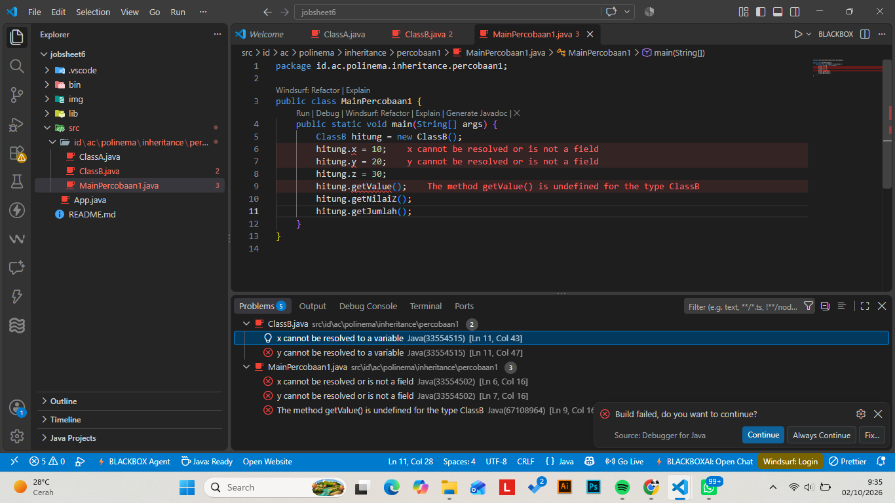
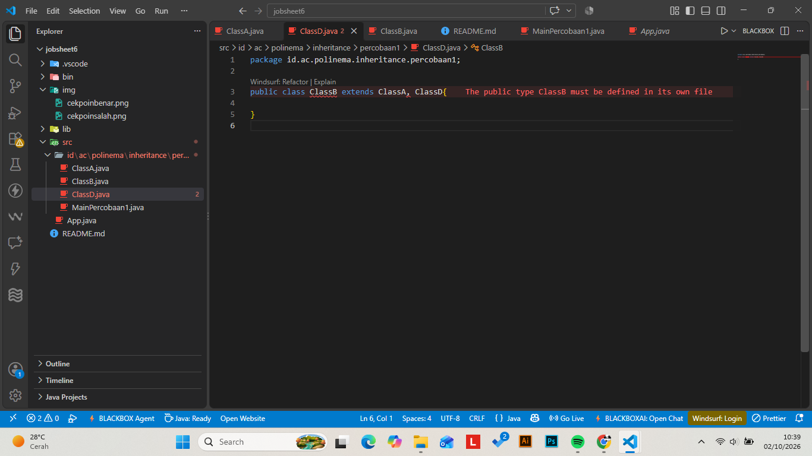
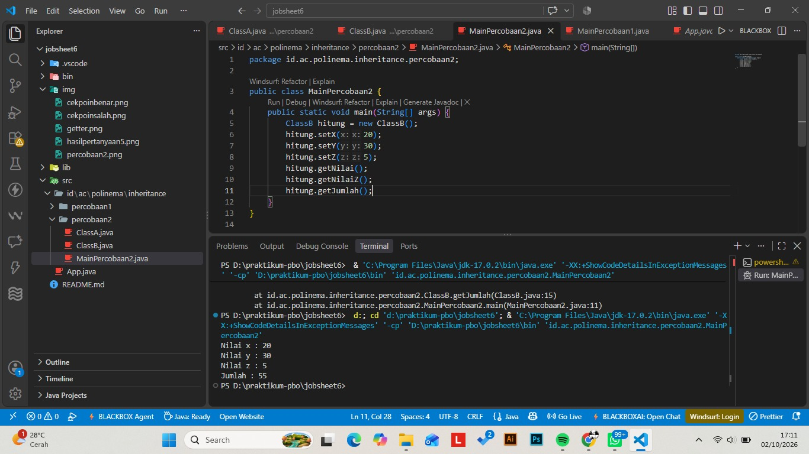
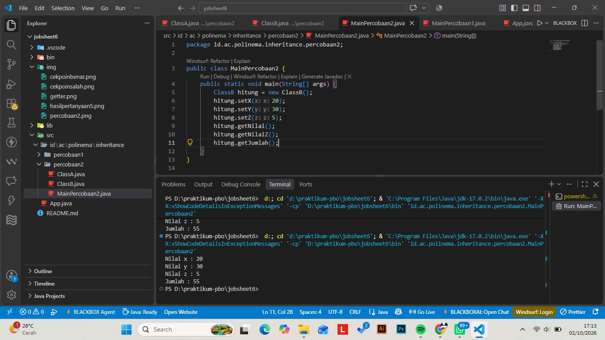
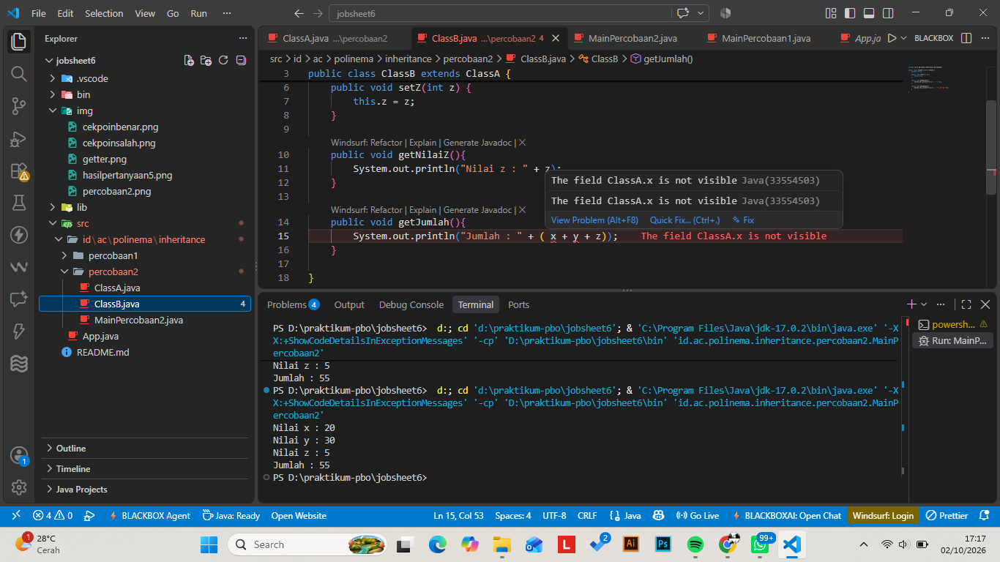
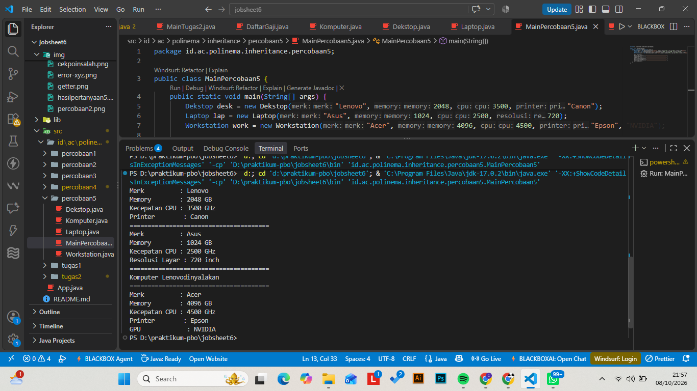

# Laporan Praktikum - Jobsheet 6: Inheritance

---
* **Nama**  : Camelia Azzahra
* **NIM**   : 264107027014
* **Kelas** : Teknik Informatika - 2G

---
#  Percobaan 1: Single Inheritance dengan `extends`
## Pertanyaan Percobaan 1
1. Mengapa kompilasi pada Langkah 5 gagal? Tuliskan pesan error pertama beserta file dan
baris tempat error muncul.
*Jawab:* **x cannot be resolved to a variable Java(33554515) [Ln 11, Col 43]**
*Kompilasi gagal karena ClassB belum ditambahkan kata kunci extends ClassA pada deklarasi kelasnya, atau karena variabel x dan y belum diwariskan/dideklarasikan di dalam ClassB. Akibatnya, Java tidak mengenali simbol variabel x dan y saat dipanggil di dalam ClassB maupun melalui objek ClassB di MainPercobaan1.java.*

2. Baris kode mana yang diubah pada Langkah 6, dan apa artinya? Sebutkan class yang
berperan sebagai superclass dan subclass.
*Jawab:* **public class ClassB extends ClassA**
*Perubahan dilakukan pada deklarasi kelas ClassB di file ClassB.java, yaitu dengan menambahkan kata kunci extends ClassA*
*Penambahan extends ClassA berarti kelas ClassB melakukan pewarisan (inheritance) dari kelas ClassA. Dengan ini, ClassB secara otomatis mewarisi seluruh atribut (x, y) dan metode (getNilai()) berakses public atau protected dari ClassA tanpa harus mendefinisikannya ulang.*

3. Setelah diperbaiki, sebutkan atribut dan method yang dapat dipakai oleh objek hitung.
Kelompokkan mana yang dideklarasikan di ClassA dan mana yang dideklarasikan di ClassB.
*Jawab:*
Objek hitung (bertipe ClassB) dapat menggunakan anggota kelas sebagai berikut:
- Dideklarasikan di ClassA (Diwarisi oleh ClassB):
Atribut: x, y
Method: getNilai()

- Dideklarasikan di ClassB (Milik ClassB sendiri):
Atribut: z
Method: getNilaiZ(), getJumlah()

4. Pada MainPercobaan1, hitung.x = 20 ditulis pada objek ClassB, padahal atribut x tidak
dideklarasikan di ClassB. Mengapa hal ini diperbolehkan?
*Jawab:*
Hal ini diperbolehkan karena ClassB telah melalukan pewarisan dari ClassA (extends ClassA). Konsep inheritance menyebabkan seluruh atribut dan method yang berakses public (maupun protected) pada superclass (ClassA) secara otomatis menjadi bagian dari subclass (ClassB). Oleh karena itu, objek dari ClassB memiliki dan dapat mengakses atribut x secara langsung.

5. Atribut x dan y pada ClassA dibuat public, sehingga dapat diubah langsung dari
MainPercobaan1. Apa risiko dari desain seperti ini? (jawaban ini akan kita telusuri pada
Percobaan 2)
*Jawab:*
Risiko dari penggunaan hak akses public pada atribut adalah melanggar prinsip enkapsulasi (data hiding). Atribut dapat diubah secara bebas dan tidak terkontrol dari luar kelas tanpa melalui validasi. Jika ada nilai yang tidak valid(misal memasukkan nilai negatif atau null) atau merusak logika program, tidak ada mekanisme pencegahan dari dalam kelas.

6. Coba tambahkan class ClassD lalu ubah deklarasi menjadi public class ClassB extends
ClassA, ClassD. Apa yang terjadi? Apa yang dapat Anda simpulkan tentang jumlah
superclass langsung pada Java?
*Jawab:*
Yang terjadi adalah Terjadi error kompilasi pada baris deklarasi kelas tersebut (compile error). Java akan menampilkan pesan kesalahan karena sintaksis koma (,) tidak diizinkan dalam extends.
Kesimpulan:
Java tidak mendukung Multiple Inheritance (pewarisan berganda secara langsung dari banyak kelas). Setiap kelas di Java hanya boleh memiliki satu superclass langsung (Single Inheritance).

==============================================================================================================================================================================================================================

#   Percobaan 2: Hak Akses pada Pewarisan (private dan protected)
## CEK POIN LANGKAH 6

## CEK POIN LANGKAH 7

##  Pertanyaan Percobaan 2
1. Di file dan baris mana error pada Langkah 5 muncul, dan apa pesannya? Mengapa error
tidak muncul di MainPercobaan2?
*Jawab:*
Pesan errror yang muncul di terminal:
Exception in thread "main" java.lang.Error: Unresolved compilation problems: 
    The field ClassA.x is not visible
    The field ClassA.y is not visible

    at id.ac.polinema.inheritance.percobaan2.ClassB.getJumlah(ClassB.java:15)
*yang berarti lokasi error berada di file ClassB.java pada line 15.*

**Alasan muncul error di ClassB.java:**
*Error terjadi di dalam method getJumlah() pada file ClassB.java karena method tersebut berusaha mengakses variabel x dan y secara langsung padahal atribut x dan y di ClassA telah diubah access modifiernya menjadi private. Atribut berakses private tidak dapat diakses langsung oleh subclass (ClassB).*

**Mengapa Error Tidak Muncul Langsung di MainPercobaan2.java?**
*Pada MainPercobaan2.java, pengisian nilai dilakukan menggunakan method setter yang berakses public (hitung.setX(20), hitung.setY(30)), bukan mengakses langsung atribut hitung.x atau hitung.y. Karena MainPercobaan2 memanggil method public yang valid, tidak ada kesalahan code di MainPercobaan2.java. Error terpicu saat program dijalankan dan saat mengeksekusi hitung.getJumlah() di mana kode di dalam ClassB.java masih mencoba mengakses variabel private secara langsung.*

2. Jelaskan penyebab error tersebut dengan merujuk pada tabel kontrol pengaksesan
(Langkah 1).
*Jawab:*
| Access Modifier | Class Sama |    Subclass    |    Subclass    |  Class manapun  |
                  |            | (Package Sama) | (Package Beda) |                 |
| --------------- |------------|----------------|----------------|-----------------|
| `private`       |     Ya     |     Tidak      |     Tidak      |     Tidak       |
| `protected`     |     Ya     |       Ya       |     Tidak      |     Tidak       |
| `public`        |     Ya     |       Ya       |      Ya        |     Tidak       |
| `default`       |     YA     |       Ya       |     Tidak      |     Tidak       |
*Berdasarkan aturan tabel pengaksesan di atas: Member berakses private hanya dapat diakses oleh kelas yang mendeklarasikannya sendiri (kalau dalam konteks percobaan 2 langlah 2 ini di dalam ClassA). Walaupun ClassB merupakan subclass (child class) dari ClassA, hak akses private melarang kelas turunan untuk mengakses atribut tersebut secara langsung. Agar atribut x dan y dapat digunakan kembali oleh ClassB, pengaksesan harus menggunakan method public (seperti getX() dan getY())atau mengganti akses atribut dari private menjadi protected.*

3. Pada kode awal, MainPercobaan2 memanggil hitung.setX(20) dan tidak error, padahal x
bersifat private. Mengapa pemanggilan ini diperbolehkan, dan di mana nilai x tersimpan?
*Jawab:*
**Mengapa Pemanggilan setX(20) Diperbolehkan:**
Pemanggilan hitung.setX(20) diperbolehkan karena method setX(int x) dideklarasikan dengan access modifier public di dalam kelas induk (ClassA). 
Atribut x memang bersifat private sehingga tidak bisa diakses langsung (hitung.x = 20 akan error), tetapi method setX berada di dalam kelas yang sama dengan x yaitu ClassA, sehingga method setX memiliki akses penuh untuk mengubah nilai variabel x tersebut. Ini merupakan penerapan dari konsep Enkapsulasi.
**Di Mana Nilai x Tersimpan:**
Nilai 20 tersimpan di dalam memori objek hitung dari ClassB pada area Heap Memory.
Meskipun atribut x dideklarasikan di ClassA dan bersifat private, saat objek hitung dibuat new, ClassB mewarisi struktur dari ClassA. Oleh karena itu, memori yang dialokasikan untuk objek hitung tetap mencakup atribut x milik ClassA, hanya saja akses langsung ke variabel tersebut dibatasi oleh aturan access modifier.

4. Bandingkan Perbaikan A (protected) dan Perbaikan B (private + getter) dari sisi
encapsulation. Mana yang Anda pilih untuk program sungguhan? Jelaskan alasannya.
*Jawab:*
**Perbandingan dari Sisi Encapsulation:**
Perbaikan A (protected): Tingkat encapsulation nya sedang. Atribut bisa diakses dan diubah secara langsung oleh subclass maupun kelas lain yang berada dalam package yang sama.

Perbaikan B (private + getter/setter): Tingkat encapsulation nya sangat kuat. Atributnya benar-benar tersembunyi(data hiding). Akses baca/tulis diatur sepenuhnya lewat method, sehingga kita bisa menambahkan validasi logika lainnya jika diperlukan dalam study case yang lain.

**Pilihan & Alasan untuk Program Sungguhan:**
Saya pribadi lebih memilih Perbaikan B (private + getter/setter).
Alasannya:
- Keamanan Data Lebih Terjamin: Kalau atribut dibuat private, nilainya tidak bisa diubah sembarangan dari luar tanpa sepengetahuan kelas pemiliknya.
- Mencegah Bug Tersembunyi: Jika ada kesalahan nilai data di kemudian hari, kita tinggal menelusuri method setternya saja, bukan mencari di puluhan file kelas anak yang mengubah variabel tersebut secara langsung.

5. Andaikan ClassA dan ClassB berada di package yang berbeda. Berdasarkan tabel, apakah
ClassB tetap dapat mengakses atribut protected milik ClassA? Bagaimana jika atributnya
default (tanpa modifier)?
*Jawab:*
**Jika Atribut bersifat protected:**
Ya, ClassB tetap dapat mengaksesnya. Hal ini dikarenakan ClassB merupakan subclass (kelas turunan) dari ClassA (ClassB extends ClassA). Berdasarkan tabel kontrol pengaksesan, atribut/method berstatus protected memberikan hak akses khusus kepada subclass meskipun berada di dalam package yang berbeda.

**Jika Atribut bersifat default(tanpa modifier):**
Tidak, ClassB tidak dapat mengaksesnya. Atribut dengan akses default bersifat package-private, artinya atribut tersebut hanya dapat diakses oleh kelas-kelas yang berada dalam satu package yang sama. Ketika ClassB berada di package berbeda, hak akses tersebut otomatis tertutup meskipun ClassB adalah subclass dari ClassA.

==============================================================================================================================================================================================================================

#   Percobaan 3: Kata Kunci this dan super (Bangun dan Tabung)
1. Jelaskan fungsi super pada super.phi = phi; dan super.r = r; di method setSuperPhi()
dan setSuperR() milik Tabung.
*Jawab:*
Kata kunci super berfungsi untuk merujuk langsung ke atribut phi dan r yang dideklarasikan di dalam superclass (Bangun). Hal ini memastikan bahwa nilai yang dimasukkan lewat parameter method disalurkan dan disimpan ke dalam atribut milik kelas induk (Bangun), bukan atribut lokal milik Tabung.

2. Jelaskan fungsi super dan this pada ekspresi super.phi * super.r * super.r * this.t di
method volume().
*Jawab:*
super: Digunakan untuk mengambil nilai variabel phi dan r yang tersimpan pada kelas induk (Bangun).
this: Digunakan untuk mengambil nilai variabel t (tinggi) yang dideklarasikan dan tersimpan pada kelas itu sendiri (Tabung).

3. Mengapa Tabung tidak mendeklarasikan atribut phi dan r, tetapi tetap dapat
mengaksesnya? Apa yang terjadi bila pada Bangun keduanya diubah menjadi private?
*Jawab:*
Mengapa tetap dapat mengaksesnya: Karena Tabung melakukan pewarisan (inheritance) dari Bangun (class Tabung extends Bangun), sehingga seluruh atribut berakses protected milik Bangun otomatis diwariskan ke Tabung.
Jika diubah menjadi private: Tabung akan mengalami compile error saat mengakses super.phi atau super.r secara langsung, karena akses private membatasi variabel hanya bisa diakses di dalam kelas Bangun saja.

4. Pada Eksperimen 1, apakah output berubah ketika super.phi diganti this.phi? Jelaskan
mengapa.
*Jawab:*
Output tidak berubah. Hal ini terjadi karena pada Eksperimen 1, kelas Tabung tidak mendeklarasikan variabel phi sendiri. Saat kita memanggil this.phi, Java akan mencari variabel phi di kelas Tabung terlebih dahulu, dan karena tidak ada, Java secara otomatis mencari ke superclass (Bangun).

5. Pada Eksperimen 2, mengapa r, this.r, dan super.r menghasilkan nilai yang berbeda?
Pada kondisi apa awalan super. menjadi wajib dipakai?
*Jawab:*
Penyebab perbedaan nilai:r dan this.r merujuk ke atribut r milik Tabung (yang nilainya 5).   
super.r merujuk ke atribut r milik superclass Bangun (yang diisi nilai 10 lewat setSuperR).
Kapan super. wajib dipakai:
Awalan super. wajib digunakan saat terjadi variable shadowing (yaitu ketika subclass mendeklarasikan atribut dengan nama yang persis sama seperti atribut di superclass). Tanpa super., pemanggilan nama atribut akan selalu merujuk ke atribut milik subclass itu sendiri (this)

==============================================================================================================================================================================================================================

# Percobaan 4: Konstruktor dan Multilevel Inheritance (ClassA, ClassB, ClassC)
**Pertanyaan Percobaan 4**
1. Sebutkan class yang berperan sebagai superclass dan subclass pada percobaan ini beserta
alasannya. Mengapa ClassB disebut berperan ganda?
*Jawaban*
ClassA: Berperan sebagai superclass utama karena dideklarasikan paling atas dan tidak melakukan extends ke kelas mana pun.   
ClassB: Berperan sebagai subclass bagi ClassA (karena extends ClassA) sekaligus menjadi superclass bagi ClassC.   
ClassC: Berperan sebagai subclass dari ClassB (karena extends ClassB).   
Mengapa ClassB Berperan Ganda:
ClassB berada di posisi tengah hirarki multilevel inheritance. ClassB mewarisi sifat dari ClassA, namun di saat yang sama diturunkan lagi ke ClassC.

2. Program hanya membuat satu objek (new ClassC()), tetapi tiga baris tercetak. Jelaskan
mengapa konstruktor ClassA dan ClassB ikut dijalankan.
*Jawaban*
mengapa konstruktor ClassA dan ClassB ikut dijalankan.
Hal ini terjadi karena adanya mekanisme Constructor Chaining pada Java. Ketika sebuah subclass diinstansiasi, Java mewajibkan superclassnya dibentuk terlebih dahulu. Walaupun kita tidak menulisnya secara manual, compiler Java secara otomatis menambahkan pemanggilan super() di baris pertama setiap konstruktor untuk mengeksekusi konstruktor kelas induk di atasnya.

3. Pada Modifikasi 1, mengapa output tidak berbeda dari sebelumnya meskipun super();
ditambahkan secara eksplisit?
*Jawaban*
Output tidak berubah karena pernyataan super(); sudah ditambahkan secara otomatis oleh compiler Java di baris pertama konstruktor jika kita tidak menuliskannya secara eksplisit. Menuliskan super(); secara manual hanya memperjelas pemanggilan yang sebenarnya memang sudah terjadi di balik layar.

4. Pada Modifikasi 2 terjadi error. Aturan apa yang dilanggar, dan mengapa Java menetapkan
aturan tersebut?
*Jawaban*
**Aturan yang Dilanggar:**
Aturan bahwa pemanggilan super() harus selalu menjadi pernyataan pertama (first statement) di dalam suatu konstruktor.
**Alasan Java Menetapkan Aturan Tersebut:**
Untuk menjamin bahwa seluruh bagian (state) dari kelas induk (superclass) sudah terinisialisasi dengan sempurna di memori sebelum subclass melakukan inisialisasi atau manipulasi atribut milik kelas itu sendiri.

5. Tuliskan urutan proses (bernomor) yang terjadi ketika new ClassC() dieksekusi, dimulai
dari pemanggilan konstruktor ClassC hingga seluruh output tercetak.
    **1. new ClassC() dipanggil MainPercobaan4.java**
    **2. eksekusi kedalam konstruktor ClassC()**
    **3. Baris pertama ClassC() memanggil super() secara implisit untuk menuju ke konstruktor ClassB()**
    **4. Eksekusi masuk ke dalam konstruktor ClassB()**
    **5. Baris pertama ClassB() memanggil super() secara implisit untuk menuju ke konstruktor ClassA()**
    **6. Eksekusi masuk ke dalam konstruktor ClassA(). Karena ClassA tidak memiliki superclass (selain Object), perintah cetak dijalankan: "konstruktor A dijalankan"**
    **7. Kontrol kembali ke konstruktor ClassB(), lalu menjalankan perintah cetak: "konstruktor B dijalankan"**
    **8. Kontrol kembali ke konstruktor ClassC(), lalu menjalankan perintah cetak: "konstruktor C dijalankan"**
    **9. Objek ClassC selesai dibuat di memori**

==============================================================================================================================================================================================================================

# Percobaan 5: Konstruktor Berparameter dan Overriding (Komputer, Desktop, Laptop)
1. Jelaskan fungsi super(merk, memory, cpu) pada konstruktor Desktop. Atribut apa saja yang
diisi oleh baris tersebut, dan atribut apa yang diisi oleh baris berikutnya?
*Jawab:*
fungsinya untuk meengeksekusi konstruktor berparameter milik subclass(Komputer)
atribut yang diisi oleh super(...) adalah atribut warisan dari komputer, yaitu merk, kapasitasMemory, dan kecepatanCPU.

2. Pada Eksperimen 1, mengapa error muncul di sini, padahal pada Percobaan 4 super() juga
tidak ditulis tetapi program tetap berjalan?
*Jawab:*
Pada Percobaan 4: Superclass (ClassA & ClassB) memiliki konstruktor tanpa parameter. Ketika super() tidak ditulis, Java secara otomatis menyisipkan super() tanpa argumen di balik layar sehingga program tetap berjalan.   
Pada Eksperimen 1 (Percobaan 5): Superclass (Komputer) hanya memiliki konstruktor berparameter dan tidak menyediakan konstruktor tanpa parameter. Saat super(...) dihapus, Java mencoba menyisipkan super() tanpa parameter secara otomatis, namun karena tidak ada konstruktor yang cocok di Komputer, kompilasi menjadi gagal.   

3. Method showInfo() ditulis di Komputer sekaligus di Desktop. Apa istilah untuk kondisi ini?
Apa yang tercetak bila baris super.showInfo(); pada Desktop dihapus?
*Jawab:*
istilahnya yaitu methode overriding(penulisan ulang method milik superclass di dalam subclass).
dampaknya jika super.showInfo(); dihapus, baris informasi warisan (Merk, Memory, dan Kecepatan CPU)tidak akan tercetak. Output yang keluar hanya informasi dari Desktop saja, yaitu baris Printer :[nama_printer].

4. Pada Eksperimen 2, jelaskan perbedaan hasil kompilasi dengan dan tanpa @Override. Apa
manfaat menuliskan @Override?
*Jawab:*
- kompilasi dengan @Override hasilnya kompilasi gagal karena kompiler mendeteksi bahwa nama method showinfo() tdk cocok dgn nama method showInfo() di superclass.
- kompilasi tanpa @Override hasilnya kompilasi berhasil, namun java menganggap method showinfo() sebagai method baru milik Dekstop yang tidak berhubungan dengan Komputer. Akibatnya, saat desk.showInfo() dipanggil, yang dieksekusi adalah method milik Komputer, sehingga baris Printer tidak tercetak
manfaatnya *@Override sebagai fitur validasi agar compiler dapat mendeteksi kesalahan penulisan(typo nama method atau tipe parameter) sebelum program dijalankan.

5. Tantangan. Buat class Workstation sebagai turunan Desktop dengan atribut gpu (String).
Class ini harus menimpa showInfo() sehingga menampilkan seluruh informasi Desktop
ditambah baris GPU. Ketika new Workstation(...) dibuat, konstruktor class apa saja yang
terpanggil, dan dalam urutan apa?
*Jawab:*

Kesimpulan:
Ketika statement new Workstation(...) dieksekusi, terjadi mekanisme Constructor Chaining (pemanggilan konstruktor berantai) Sebagai subclass dari Dekstop (yang juga merupakan subclass dari Komputer) Workstation secara otomatis mewarisi seluruh atribut dan method dari kedua kelas di atasnya (Komputer -> Dekstop -> Workstation).
Penggunaan instruksi super(...) memastikan atribut dari class induk terinisialisasi dengan benar sebelum atribut spesifik (gpu) diisi
Penerapan @Override pada method showInfo() di class Workstation dengan melakukan penambahan informasi baru (GPU) tanpa perlu menulis ulang kode pencetakan Merk, Memory, Kecepatan CPU, dan Printer. Cukup dengan memanggil super.showInfo(), logika pencetakan dari class induk dapat dimanfaatkan kembali secara efisien.
==================================================================================================================================================================================================================

# Tugas 1: Pegawai, Dosen, dan DaftarGaji

# Jawaban Pertanyaan Analisis Tugas 1:
**Penggabungan Inheritance (Dosen pewarisi Pegawai) dan Aggregation (DaftarGaji menyimpan kumpulan Pegawai)**
*1. Mengapa Array Pegawai[] dapat menampung objek Dosen?*
Karena Dosen adalah turunan (subclass) dari Pegawai (hubungan is-a). Dalam OOP (Polimorfisme), objek dari subclass secara otomatis bertipe data superclassnya, sehingga dapat disimpan di dalam array bertipe superclass.

*2. Ketika printSemuaGaji() memanggil getGaji() pada objek Dosen, versi method class mana yang dijalankan?*
Versi method milik class Dosen. Hal ini terjadi karena mekanisme Dynamic Method Dispatch (Polimorfisme runtime) dimana Java akan mengeksekusi method yang sudah di override oleh tipe objek sebenarnya saat run code.

# Tugas 2: Televisi dan TelevisiModern
**Encapsulation dan Inheritance**

# Tugas 4: Jawab Singkat
1. Jelaskan dengan bahasa Anda sendiri perbedaan hubungan is-a (inheritance) dan has-a
(aggregation/composition), lalu beri satu contoh masing-masing dari jobsheet ini.
*Jawab:*
Perbedaan hubungan is-a (inheritance): Hubungan pewarisan dimana cublass merupakan bentuk spesifik dari superclass
Contoh: Dosen is-a Pegawai
Perbedaan hubungan has-a (aggregation/composition): Hubungan kepemilikan dimana suatu class memiliki/mengandung objek dari class lain.
Contoh: DaftarGaji has-a Pegawai 

2. Ringkas aturan pewarisan untuk tiga hal berikut dalam 3–5 kalimat: member private,
member protected, dan konstruktor.
*Jawab:*
Member private
Tidak dapat diwariskan maupun diakses secara langsung oleh subclass. acces hanya bisa dilakukan melalui method setter/getter milik superclass.
    
Member protected
dapat diwariskan maupun diakses secara langsung oleh subclass, serta oleh class lain yang berada dalam package yang sama.

Konstruktor
Tidak diwariskan ke subclass, namun wajib dipanggil dari konstruktor subclass menggunakan kata kunci super(...).

### overriding
method yang diwariskan dan di custom sendiri oleh anaknya
karena method punya kesamaan sifat ke semua anak classnya

### overload
membuat method yg baru dgn nama yg sama
tujuan membuat method yang sama tetapi data yang dimasukkan berbeda
